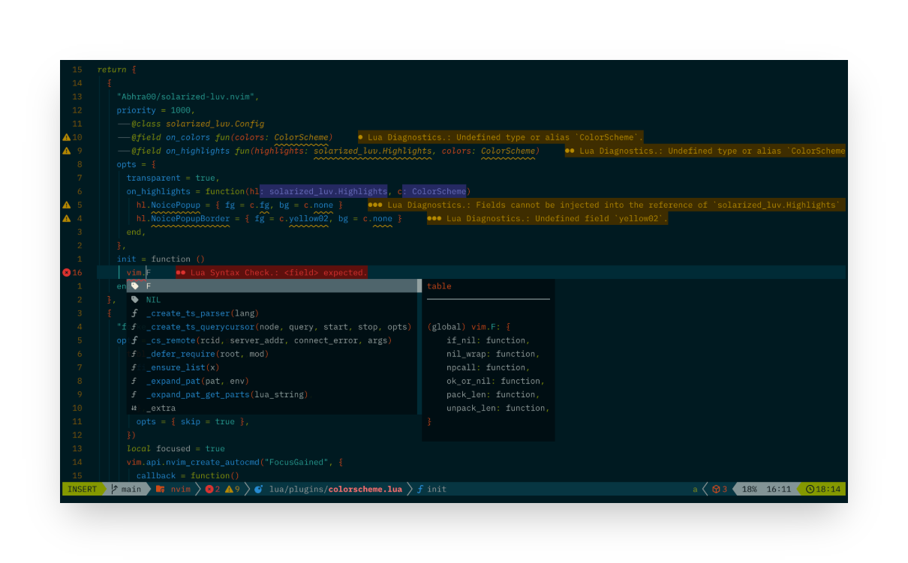
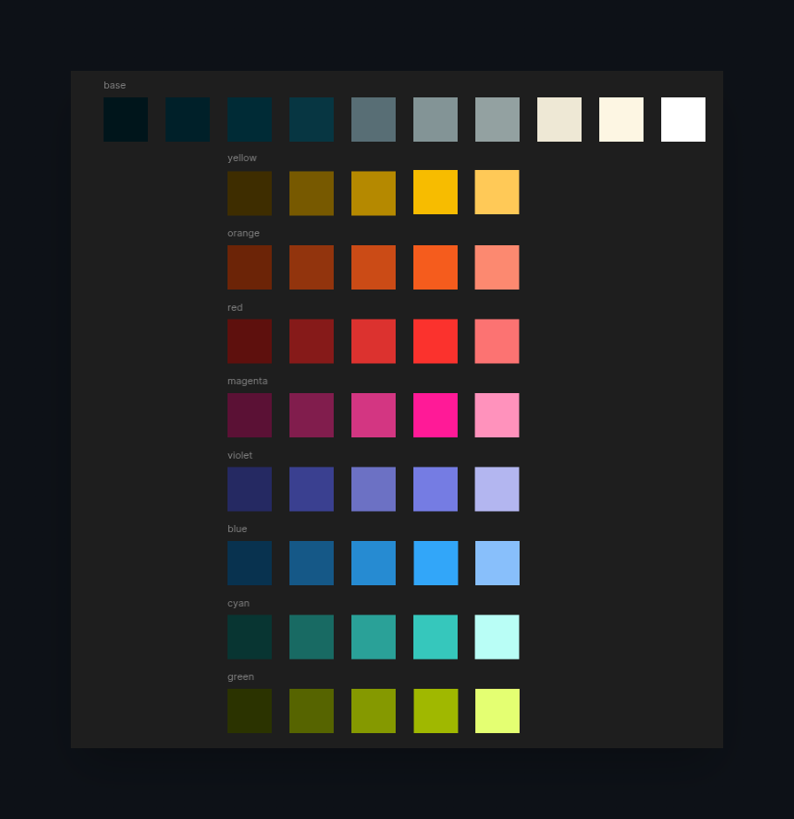

<h3 align="center">
	
    A clean, pleasant dark theme for Neovim
	
</h3>

  
  <h3>Color Palette</h3>

  
  <h3>Supported Plugins</h3>

<!-- plugins:start -->

| Plugin | Source |
| --- | --- |
| [alpha-nvim](https://github.com/goolord/alpha-nvim) | [`alpha`](lua/solarized-luv/groups/alpha.lua) |
| [barbar.nvim](https://github.com/romgrk/barbar.nvim) | [`barbar`](lua/solarized-luv/groups/barbar.lua) |
| [blink.cmp](https://github.com/Saghen/blink.cmp) | [`blink`](lua/solarized-luv/groups/blink.lua) |
| [bufferline.nvim](https://github.com/akinsho/bufferline.nvim) | [`bufferline`](lua/solarized-luv/groups/bufferline.lua) |
| [gitsigns.nvim](https://github.com/lewis6991/gitsigns.nvim) | [`gitsigns`](lua/solarized-luv/groups/gitsigns.lua) |
| [lazy.nvim](https://github.com/folke/lazy.nvim) | [`lazy`](lua/solarized-luv/groups/lazy.lua) |
| [mini.hipatterns](https://github.com/echasnovski/mini.hipatterns) | [`mini_hipatterns`](lua/solarized-luv/groups/mini_hipatterns.lua) |
| [mini.icons](https://github.com/echasnovski/mini.icons) | [`mini_icons`](lua/solarized-luv/groups/mini_icons.lua) |
| [mini.indentscope](https://github.com/echasnovski/mini.indentscope) | [`mini_indentscope`](lua/solarized-luv/groups/mini_indentscope.lua) |
| [noice.nvim](https://github.com/folke/noice.nvim) | [`noice`](lua/solarized-luv/groups/noice.lua) |
| [nvim-notify](https://github.com/rcarriga/nvim-notify) | [`notify`](lua/solarized-luv/groups/notify.lua) |
| [snacks.nvim](https://github.com/folke/snacks.nvim) | [`snacks`](lua/solarized-luv/groups/snacks.lua) |
| [telescope.nvim](https://github.com/nvim-telescope/telescope.nvim) | [`telescope`](lua/solarized-luv/groups/telescope.lua) |
| [nvim-treesitter-context](https://github.com/nvim-treesitter/nvim-treesitter-context) | [`treesitter-context`](lua/solarized-luv/groups/treesitter-context.lua) |

<!-- plugins:end -->

# Credits
- [Solarized](https://ethanschoonover.com/solarized/)
- [Tokyonight](https://github.com/folke/tokyonight.nvim)
- [Solarized-Osaka](https://github.com/craftzdog/solarized-osaka.nvim)
